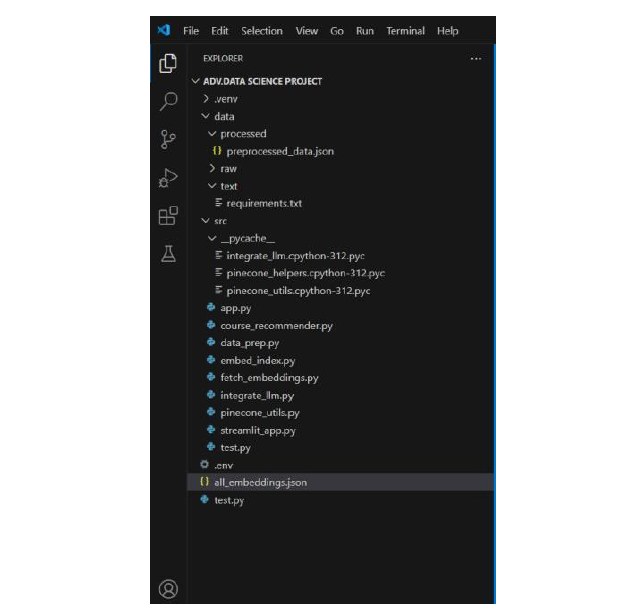
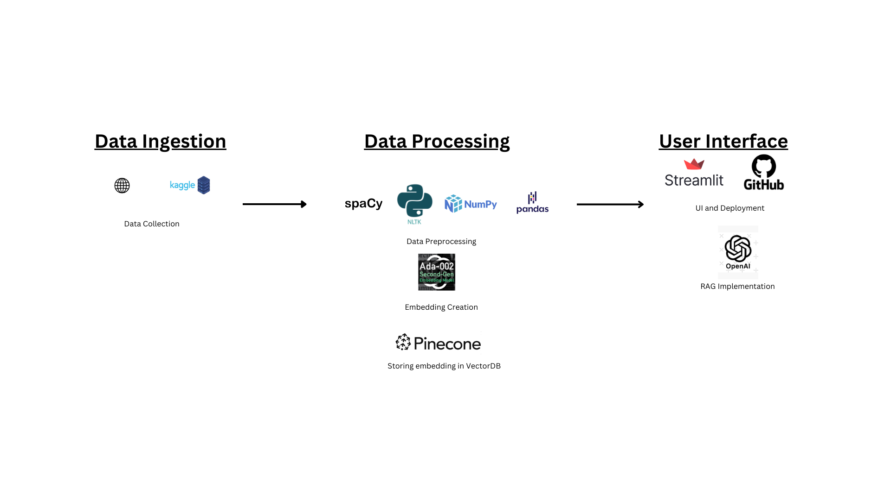
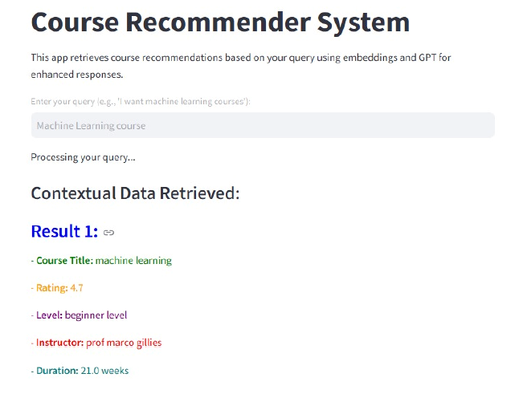
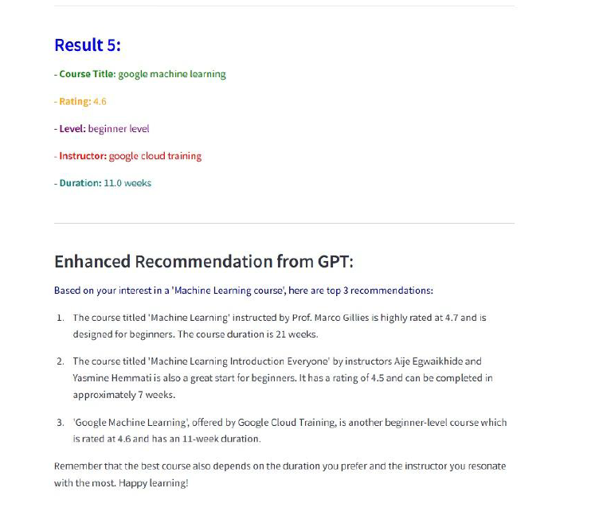

# Course Recommender Assistant

A project powered by **AI (LLM)** and **Retrieval-Augmented Generation (RAG)** to provide personalized course recommendations tailored to user queries. Built as part of **INFO 7390 - Advances in Data Sciences and Architecture**, this project demonstrates advanced AI integration and user-focused solutions.

## Table of Contents

1. [Introduction](#introduction)
2. [Objectives](#objectives)
3. [Technologies and Tools](#technologies-and-tools)
4. [System Architecture](#system-architecture)
5. [Implementation Details](#implementation-details)
6. [Frontend Features](#frontend-features)
7. [Advanced Features and Future Enhancements](#advanced-features-and-future-enhancements)
8. [Conclusion](#conclusion)

---

## Introduction

The **Course Recommender Assistant** streamlines course discovery by:
- Utilizing **LLM** for contextual understanding of user queries.
- Employing **RAG** to fetch relevant and personalized recommendations.
- Integrating dynamic UI for an interactive experience.

**Key Features:**
- Data preprocessing for structured datasets.
- Embedding generation using OpenAI’s Ada-002 model.
- Efficient similarity searches via Pinecone vector database.
- A Streamlit-powered frontend for real-time user interactions.

---

## Objectives

- Personalize course recommendations.
- Enable advanced filtering options.
- Deliver fast, accurate results using embeddings and vector search.

---

## Technologies and Tools

- **Data Preprocessing:** Pandas, Regex, NumPy, NLP tools.
- **Database Management:** Pinecone (vector similarity search).
- **AI/ML Models:** OpenAI API for embeddings.
- **Frontend Development:** Streamlit.
- **Deployment:** Docker, Git.

---

## System Architecture

**Workflow:**
1. User enters a query in the frontend.
2. Query is preprocessed for embedding generation.
3. Pinecone retrieves relevant course embeddings.
4. Results are ranked and displayed dynamically.

**Components:**
- **Data Ingestion:** Collects structured datasets (Kaggle, web scraping).
- **Data Processing:** Cleans data, generates embeddings.
- **Database:** Stores embeddings in Pinecone.
- **Frontend:** Displays recommendations with filtering.

---

## Implementation Details

### Step 1: Data Collection and Preprocessing

- **Sources:** Kaggle, web scraping (Coursera, Udemy, edX).
- **Collected Info:** Title, platform, duration, ratings, user reviews, URLs.
- **Preprocessing Tools:** Pandas, Regex, NLP tools (spaCy, NLTK).

### Step 2: Vector Database Setup

- **Database:** Pinecone for fast similarity searches.
- **Embedding Model:** OpenAI Ada-002 for semantic representations.
- **Metadata:** Tags like categories, platforms, and ratings for filtering.

### Step 3: Frontend Development

- **Framework:** Streamlit for UI prototyping.
- **Features:** Query input, filter sidebar, real-time result updates.

---

## Frontend Features

1. **Homepage:** Introduces the system.
2. **Query Input:** Accepts natural language queries.
3. **Results Display:** Summarized course details (title, platform, duration, ratings).
4. **Filters:** Options for duration, platform, and ratings.
5. **Interactivity:** Dynamic updates for smooth user experience.

---

## Advanced Features and Future Enhancements

### Current Features
- Natural language understanding for precise results.
- Real-time updates as users interact with filters.

### Future Enhancements
- **Personalization:** User profiles for tailored recommendations.
- **Integration:** Support multiple learning platforms.
- **Scalability:** Transition to React.js for advanced UI.
- **Recommendation Scores:** Confidence levels for each suggestion.

---

## Conclusion

The **Course Recommender Assistant** effectively bridges the gap between learners and quality educational content by leveraging **AI**, **RAG**, and modern technologies. It offers a scalable and user-centric approach to personalized course discovery.

---

## References

- [Streamlit Documentation](https://docs.streamlit.io/)
- [Pandas Documentation](https://pandas.pydata.org/docs/)
- [Pinecone Documentation](https://docs.pinecone.io/guides/get-started/overview)
- [OpenAI API Documentation](https://platform.openai.com/docs/api-reference)
- [Docker Documentation](https://docs.docker.com/)

---

**Source Code:** [GitHub Repository Link](#)
